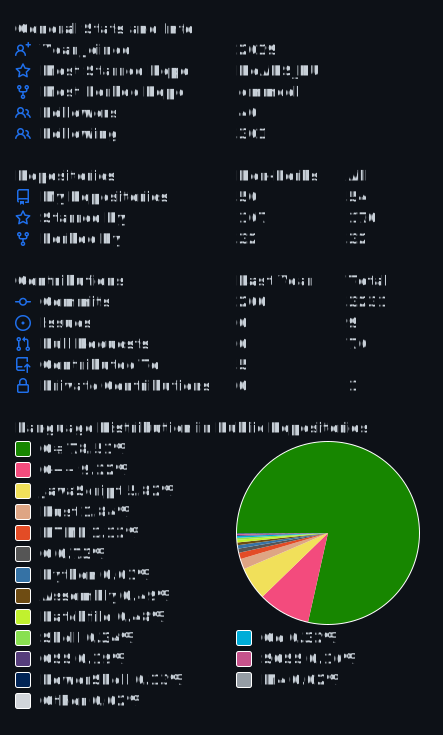

# Hi cool coder 🤘

## 😸 Nickname

  👤 [Nickname Certificate](https://mynickname.com/en/Zalexanninev15)
  
## ♌ About me

- My path as a developer began in 2013. In the programming group, I started with **LogoWorlds (RU)**, then studied **Turbo Pascal** (on MS-DOS!!!). The most interesting process was creating my own game, but I was more interested in creating an engine, so I didn't finish the project. This is how I finished my training in the group in 2015. Until about 2018, I created projects for myself on **Pascal** and **PHP** (DevelStudio), in 2019 I discovered a wonderful **C#** language. It was incredible, I hadn't even thought about another language before, which was a huge mistake. And I studied this language to create a utility for flash of the smartphone ZTE Blade V9 Vita - [BV9Vita (RU)](https://4pda.to/forum/index.php?showtopic=952274&view=findpost&p=88382383). I liked the development so much that I decided to significantly develop the project to [NineVita (RU)](https://4pda.to/forum/index.php?showtopic=952274&view=findpost&p=91409816). And off it went... New projects and new discoveries. 

- I am a developer of applications for Windows (if necessary, try it under Linux and Web 😊). Know **C#** (2 years) and **Markdown**, use **WinForms** & **Console** and **Python** & **PHP** & **Bash** & **Batch** for scripts. Learn: **Rust**, **HTML**, **CSS**, **JavaScript**. Previously coded on **Go**, **Mathcad**, **MATLAB**, **Scilab**, **C++**, **JPHP (DevelNext)**, **Assembler**, **PureBasic**, **Delphi (7)**, **PHP (DevelStudio)**, **SFX-Macros (RU)**, **Pascal (Turbo Pascal)** and **LogoWorlds (RU)**. I also do various creative things. I am looking for interesting projects and ready for possible cooperation.

## 🏆 Trophy

## 📫 How to reach me

  ✔️ My site: [zalexanninev15.jimdofree.com](https://zalexanninev15.jimdofree.com)

  ✔️ Email: [blue.shark@disroot.org](mailto:blue.shark@disroot.org)
  
  ✔️ Telegram: [@Zalexanninev15](https://t.me/Zalexanninev15)
  
  ✔️ 4PDA: [5330563](https://4pda.ru/forum/index.php?showuser=5330563)

  ✔️ Codeberg: [Zalexanninev15](https://codeberg.org/Zalexanninev15)

  ✔️ Teletype: [Zalexanninev15](https://teletype.in/@zalexanninev15)

  ✔️ PlayGround.ru: [1944465](https://users.playground.ru/1944465)

  ✔️ Gists: [Zalexanninev15](https://gist.github.com/Zalexanninev15)

  ✔️ Weblate (by Codeberg): [Zalexanninev15](https://translate.codeberg.org/user/Zalexanninev15)
  
  ✔️ Crowdin: [Zalexanninev15](https://crowdin.com/profile/Zalexanninev15) 

  ☕ Buy Me a Coffee: [Donate page](https://zalexanninev15.jimdofree.com/buy-me-a-coffee)

## 🔥 I use tools

  
  
  
  
  
  
  

**Windows 11** (Main system), **Visual Studio 2022** (C# - **.NET 7**), **JetBrains IntelliJ IDEA** (Rust & Python), **GitHub Desktop** (Work with my GitHub repositories and GUI for Git). For all and web: **VSCodium** and **Notepad++**. And also **TCPU** (Total Commader PowerUser) for of all my needs

## 📈 Statistics

