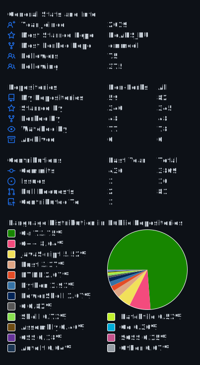

# Hi cool coder 🤘

## 😸 Nickname

  👤 [Nickname Certificate](https://mynickname.com/en/Zalexanninev15)
  
## ♌ About me

- My path as a developer began in 2013. In the programming group, I started with **LogoWorlds (RU)**, then studied **Turbo Pascal** (on MS-DOS!!!). The most interesting process was creating my own game, but I was more interested in creating an engine, so I didn't finish the project. This is how I finished my training in the group in 2015. Until about 2018, I created projects for myself on **Pascal** and **PHP** (DevelStudio), in 2019 I discovered a wonderful **C#** language. It was incredible, I hadn't even thought about another language before, which was a huge mistake. And I studied this language to create a utility for flash of the smartphone ZTE Blade V9 Vita - [BV9Vita (RU)](https://4pda.to/forum/index.php?showtopic=952274&view=findpost&p=88382383). I liked the development so much that I decided to significantly develop the project to [NineVita (RU)](https://4pda.to/forum/index.php?showtopic=952274&view=findpost&p=91409816). And off it went... New projects and new discoveries. 

- I am a developer of applications for Windows (if necessary, try it under Linux and Web 😊). Know **C#** (2 years), **Python** (1 year, I know the basics and some specialized things, for example: web parsing, working with SQLite, Telegram bots on aiogram, some payment methods and web requests), **PHP** (studied quite a bit, literally the basics of the basics) and **C++** (I know maybe not too well, but razbI know maybe not super well, but I understand relatively well and can write something simple), use **WinForms**, **Console**, **Markdown** and **Bash** & **Batch** for scripts. Learn: **Rust**, **HTML**, **CSS**, **JavaScript** and the basics of **Go**. Previously coded on **Mathcad**, **MATLAB**, **Scilab**, **JPHP (DevelNext)**, **Assembler**, **PureBasic**, **Delphi (7)**, **PHP (DevelStudio)**, **SFX-Macros (RU)**, **Pascal (Turbo Pascal & PascalABC.NET)** and **LogoWorlds (RU)**. I also do various creative things. I am looking for interesting projects and ready for possible cooperation.

- At the end of 2022, I decided to finally move completely to Linux and start a new chapter in software development, and not only software. I also created [a channel in Telegram (RU)](https://ttttt.me/funnypenguin), in which I publish my thoughts and stories. As a starting point, I settled on Manjaro with a KDE environment. The plans for 2023 are to hone their skills in working with Python and Rust. I am also studying in the "initial" web development (HTML, CSS, JavaScript). Although I will develop in C#, it is extremely rare. In early June 2023, I finally decided to try out Fedora with GNOME in the form of the Nobara Linux distribution. He reported all his torments and discoveries in my Telegram channel - [Путь в Linux (RU)](https://ttttt.me/funnypenguin).

## 🏆 Trophy

## 📫 How to reach me

  🌐 My site: [zalexanninev15.jimdofree.com](https://zalexanninev15.jimdofree.com)

  📨 Email: [blue.shark@disroot.org](mailto:blue.shark@disroot.org)
  
  ✍ Telegram: [@Zalexanninev15](https://t.me/Zalexanninev15)

  📰 Telegram channels (RU): 
  - [Гнездо программиста](https://ttttt.me/Zalexanninev15_News) — news channel and blog 
  - [Путь в Linux](https://ttttt.me/funnypenguin) — blog about life on Linux and interesting distributions
  - [Shark Remote: Новостной канал](https://ttttt.me/NewsWiT) — news channel and blog about «Shark Remote», Windows remote control application (Telegram Bot)
  
  📱 4PDA: [5330563](https://4pda.ru/forum/index.php?showuser=5330563)

  🏔 Codeberg: [Zalexanninev15](https://codeberg.org/Zalexanninev15)

  📝 Teletype: [Zalexanninev15](https://teletype.in/@zalexanninev15)
  
  🐧 Pingvinus: [Morgan](https://pingvinus.ru/user/morgan)

  🎮 PlayGround.ru: [1944465](https://users.playground.ru/1944465)

  🗒️ Gists: [Zalexanninev15](https://gist.github.com/Zalexanninev15)

  😇 Weblate (by Codeberg): [Zalexanninev15](https://translate.codeberg.org/user/Zalexanninev15)
  
  😇 Crowdin: [Zalexanninev15](https://crowdin.com/profile/Zalexanninev15) 

  ☕️ Buy Me a Coffee: [Donate page](https://zalexanninev15.jimdofree.com/buy-me-a-coffee) (*there are several payment methods available*)

## 🔥 I use tools

  
  
  
  
  
  
  
  

**Nobara Linux, Official build with GNOME** (Main system), **Brave** (Main browser), **JetBrains PyCharm** (Python), **GitHub Desktop** (GUI for Git), **Visual Studio 2022 (on Windows)** (C# - **.NET 7**). For all and web: **Gnome Text Editor**, **Visual Studio Code** and **Notepad++ (on WIndows)**. And also **TCPU (on Windows)** (Total Commader PowerUser) for of all my needs

## 📈 Statistics

